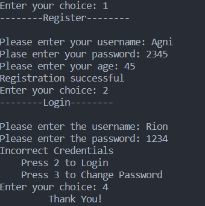

# Security-System

This is a basic project using C++ where user can -  

<pre>
1.Register
2.LogIn
3.Change Password
4.End the Program
</pre>

## Updates
<pre>
I will update this with more features soon.
If you feel like adding them on your own then feel free to do so, do remember to send the pull request.
</pre>

## Screenshot

